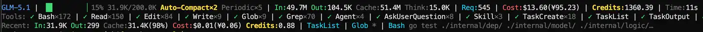

# CodeBuddy Statusline

CodeBuddy Code 的实时状态栏工具，在状态栏实时显示当前会话的 Context 进度条、Token 用量、工具调用、费用等信息。

## 环境要求

- Python 3.6+
- CodeBuddy Code v1.16.0+
- macOS / Linux / Git Bash / Windows PowerShell 均可

## 安装

### macOS / Linux / Git Bash

外网 (GitHub)：
```bash
git clone https://github.com/runzhi/codebuddy-statusline.git ~/.codebuddy/statusline
bash ~/.codebuddy/statusline/install.sh
```

内网：
```bash
git clone https://git.woa.com/four-harness/codebuddy-statusline.git ~/.codebuddy/statusline
bash ~/.codebuddy/statusline/install.sh
```

### Windows PowerShell

外网 (GitHub)：
```powershell
git clone https://github.com/runzhi/codebuddy-statusline.git "$env:USERPROFILE\.codebuddy\statusline"
powershell -ExecutionPolicy Bypass -File "$env:USERPROFILE\.codebuddy\statusline\install.ps1"
```

内网：
```powershell
git clone https://git.woa.com/four-harness/codebuddy-statusline.git "$env:USERPROFILE\.codebuddy\statusline"
powershell -ExecutionPolicy Bypass -File "$env:USERPROFILE\.codebuddy\statusline\install.ps1"
```

安装脚本会自动克隆/更新插件文件、创建缓存目录、并在 `~/.codebuddy/settings.json` 中配置 `statusLine`（已有则跳过）。安装后即时生效，无需重启会话。

## 效果预览

状态栏分三行实时显示：



### 第一行：概览

| 字段 | 说明 |
|------|------|
| `GLM-5.1` | 当前模型名称 |
| `▕████▍     ▏44%` | Context 进度条（绿 < 50%，黄 < 80%，红 >= 80%） |
| `56.7K/128.0K` | 当前 Context 用量 / 窗口上限 |
| `Compact×2` | Context 压缩次数，含自动和手动（黄色） |
| `Periodic×3` | Context 阶段摘要次数（灰色） |
| `In:2.4M` | 输入 Token 数（自动缩写 K/M） |
| `Out:10.7K` | 输出 Token 数 |
| `Cache:2.2M` | 缓存命中 Token 数 |
| `Think:952` | 推理/思考 Token 数 |
| `Req:29` | API 请求次数 |
| `Cost:$0.69(¥4.83)` | 总费用（美元/人民币），总费用 = 平台 cost + credits/100 |
| `Credits:67.20` | 消耗 Credits |
| `Time:45s` | 会话耗时 |
| `+156/-23` | 代码增删行数 |

**Compact vs Periodic 区别：**

| | Compact | Periodic |
|---|---|---|
| **本质** | 压缩——丢掉原文，换成摘要 | 打标签——给对话分段加标题 |
| **触发时机** | Context 快满时自动压缩，或手动 `/compact` | 对话进行一段后主动阶段性总结 |
| **Context 影响** | 用量明显下降 | 用量不变或微增 |

### 第二行：工具调用 & Agent 状态

```
Tools: ✓ Bash×15 | ✓ Read×2 | ✓ Edit | ↑ Agent ✓ Agent×2
```

工具按固定顺序排列（Bash → Read → Edit → Write → Glob → Grep → Fetch → Search），其他工具自动追加。Agent 区分运行中（`↑`，黄色）和已完成（`✓`，绿色）。

### 第三行：最近交互详情 & Function Call

```
Recent: In:3.2K Out:856 Cache:2.1K(65%) Cost:$0.02(¥0.11) Credits:1.50 | Bash apt-get install -y tmux | Read /data/app/main.py | Edit /data/app/config.yaml
```

左侧展示最近一次 API 交互的 Token 明细和 Cache 命中率，右侧展示最近 3 次工具调用的名称及参数摘要（超过 60 字符自动截断）。

> 注意：`In` 字段（`inputTokens`）已包含 `Cache` 命中部分，`Cache` 是 `In` 的子集，不应将两者相加。

## 自动更新

Git-clone 安装模式下，脚本内置**每天最多一次**的后台 `git pull` 自动更新机制：

- 后台异步执行，主进程立即返回，不阻塞状态栏渲染
- 失败静默：断网、非 git 仓库、本地有冲突修改等情况都安全跳过

如需禁用，将插件目录下 `.git` 改名为 `.git.disabled` 即可。

## 详细报告

随时运行查看按模型分组的详细 Token 报告：

```bash
/statusline:cost-detail

# 或直接运行
python3 ~/.codebuddy/statusline/cost-detail.py
```

输出示例：

```
================================================================================
  CodeBuddy Code - Cost & Token Usage Report
================================================================================

  GLM-5.1:
    Requests:     29
    Input:        2,352,968 (2.4M)
    Output:       10,693 (10.7K)
    Cache Read:   2,227,648 (2.2M)
    Reasoning:    952
    Credits:      67.20

--------------------------------------------------------------------------------
  TOTALS:
    Requests:     29
    Input:        2,352,968 (2.4M)
    Output:       10,693 (10.7K)
    Cache Read:   2,227,648 (2.2M)
    Reasoning:    952
    Credits:      67.20
================================================================================
```

## 卸载

```bash
# macOS / Linux / Git Bash
bash ~/.codebuddy/statusline/uninstall.sh
```

```powershell
# Windows PowerShell
powershell -ExecutionPolicy Bypass -File "$env:USERPROFILE\.codebuddy\statusline\uninstall.ps1"
```

## License

MIT
